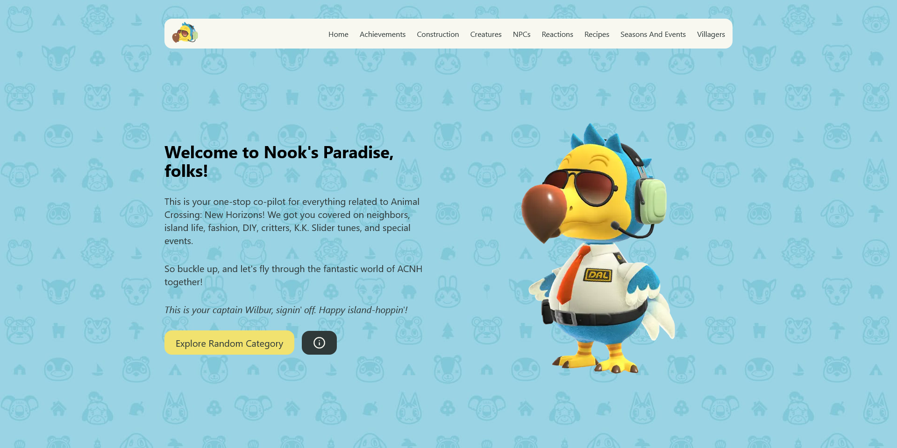

# Nook's Paradise

Welcome to the repository for Nook's Paradise. This project is an immersive and comprehensive resource for Animal Crossing fans, designed to provide detailed information about the game. Built with Next.js, TypeScript, and Tailwind CSS, the site provides an engaging user experience and a responsive design.



## Features

- **Comprehensive game data**: Utilizes the animal-crossing library to provide detailed and accurate data on various in-game items, characters, and more.
- **Search**: Users can search through the extensive data.
- **Pagination**: The site offers pagination, ensuring an organized and smooth browsing experience.
- **Responsive Design**: The site is fully responsive and provides a seamless experience across various devices and screen sizes.
- **Accessible**: Designed with accessibility in mind, following best practices.

## Project Structure

```bash
nooks-paradise
│   .eslintrc.json
│   .gitignore
│   LICENSE.md
│   next.config.js
│   package-lock.json
│   package.json
│   postcss.config.js
│   README.md
│   screenshot.png
│   tailwind.config.js
│   tsconfig.json
│
├───public
│
└───src
    ├───assets
    ├───components
    ├───contexts
    ├───hooks
    ├───pages
    ├───styles
    ├───types
    └───utils
```

- **/public**: This directory contains static resources like images.
- **/src/assets**: This directory contains assets used throughout the site.
- **/src/components**: This directory contains reusable React components.
- **/src/contexts**: This directory contains React Context providers for state management.
- **/src/hooks**: This directory contains reusable React hooks.
- **/src/pages**: This directory contains all the Next.js pages.
- **/src/styles**: This directory contains global CSS styles.
- **/src/types**: This directory contains TypeScript type definitions.
- **/src/utils**: This directory contains utility functions used across the project.

## Getting Started

1. Clone the repository:
   ```
   git clone https://github.com/your-username/nooks-paradise.git
   ```
2. Navigate to the project directory:
   ```
   cd nooks-paradise
   ```
3. Install the necessary dependencies:
   ```
   npm install
   ```
4. Run the development server:
   ```
   npm run dev
   ```

## Scripts

- **dev**: Runs the application in development mode.
- **build**: Builds the application for production.
- **start**: Starts the application in production mode.
- **lint**: Lints the application code.

## Dependencies

- **Next.js**: A JavaScript framework for building server-rendered or statically exported React apps.
- **React**: A JavaScript library for building user interfaces.
- **Tailwind CSS**: A utility-first CSS framework for rapidly building custom designs.
- **TypeScript**: A typed superset of JavaScript that compiles to plain JavaScript.
- **animal-crossing**: A library that provides detailed information about Animal Crossing game.

## Acknowledgments
Special thanks to resources like Animal Crossing Database by Norviah and Google Spreadsheets for Animal Crossing: New Horizons for their info! Hats off to Nintendo for creating another amazing Animal Crossing adventure.

## Contribute

Pull requests are welcome. For major changes, please open an issue first to discuss what you would like to change.

## License

This project is licensed under the MIT License. See the `LICENSE.md` file for more details.

## Author

This project is created by [Luis Parra](https://github.com/lsprr).

## Links

- [GitHub](https://github.com/lsprr/nooks-paradise)
- [Live Site](https://www.nooks-paradise.com)

Welcome to Nook's Paradise, your personal Animal Crossing encyclopedia!
