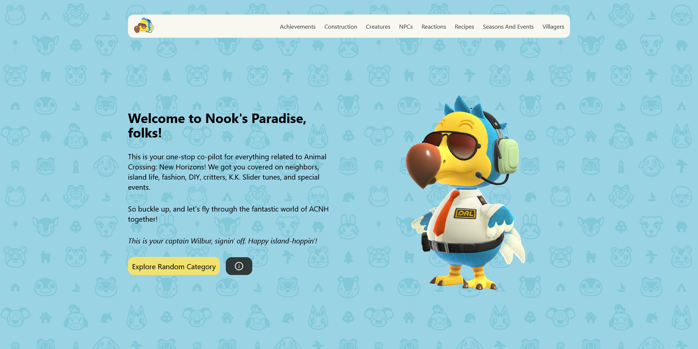

# Nook's Paradise

Welcome to Nook's Paradise, an extensive online guide and lookup tool designed specifically for all things related to the game, Animal Crossing: New Horizons.

## About

This website serves as a one-stop co-pilot for Animal Crossing enthusiasts, covering diverse categories such as neighbors, island life, fashion, DIY, critters, K.K. Slider tunes, and special events. Our mission is to enhance your gaming experience by providing easy access to a wealth of game-related information.

## Features

- **Browse Multiple Categories**: Explore a variety of categories related to Animal Crossing: New Horizons.
- **Random Category Explorer**: Feel like exploring? Click on the 'Explore Random Category' button and let us guide you to a random category.
- **Search Bar**: Search our extensive database for any information related to the game.
- **Easy Navigation**: Navigate easily across the website with a user-friendly interface.

## Development

Nook's Paradise is built with Next.js, a popular React.js framework, and utilizes server-side rendering for a fast and efficient website.

## Contribute

We appreciate all contributions to the improvement and extension of Nook's Paradise. Whether it's a bug report, new feature, correction, or additional documentation, we welcome your issues and pull requests.

## Disclaimer

Nook's Paradise is a fan-made website. All original critter thingamajigs, icons, and fancy images belong to Nintendo, and Animal Crossing is their registered trademark.

## License

This project is licensed under [MIT](./LICENSE.md).

## Acknowledgments

Special thanks to resources like Animal Crossing Database by Norviah and Google Spreadsheets for Animal Crossing: New Horizons for their info! Hats off to Nintendo for creating another amazing Animal Crossing adventure.
